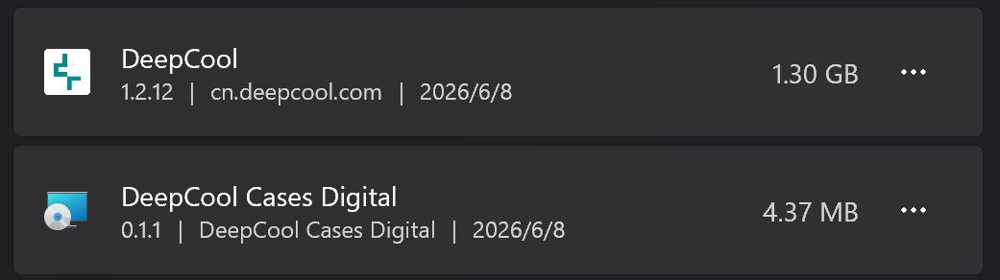

# DeepCool Cases Digital

首先感谢 [Nortank12/deepcool-digital-linux](https://github.com/Nortank12/deepcool-digital-linux)。这个项目整理了大量 DeepCool DIGITAL 设备的 Linux 端支持、设备列表和协议实现，是本项目做 Windows 轻量服务时最重要的参考来源。

DeepCool 官方 Windows 软件体积很大，如果只是想让机箱上的小数显显示 CPU/GPU 信息，会显得有些重。这个项目的目标很直接：只做 DeepCool DIGITAL 机箱数显需要的功能，以一个安静的 Windows 后台服务运行，不放托盘、不弹窗口、不打扰使用。



## 特性

- 原生 Windows MSI 安装包，安装后以 Windows 服务运行。
- 无托盘、无常驻界面，配置通过安装包的“配置”入口修改。
- 支持 CPU/GPU 显示，可设置刷新时间和轮播间隔。
- 支持 Windows 10 或更新版本。
- 当前发布为单个 MSI 安装包。

## 下载

从 GitHub Releases 下载：

- `DeepCool.Cases.Digital.zh-CN.msi`

安装包是 framework-dependent 构建，需要系统已安装 .NET 8 Desktop Runtime。

## 支持机箱

| 机箱 | 状态 |
| --- | --- |
| CH170 DIGITAL | 支持 |
| CH270 DIGITAL | 支持 |
| CH360 DIGITAL | 支持 |
| CH510 MESH DIGITAL | 支持 |
| CH560 DIGITAL | 支持 |
| CH690 DIGITAL | 支持 |
| MORPHEUS | 支持 |

## 安装与配置

1. 双击 `DeepCool.Cases.Digital.zh-CN.msi`。
2. 选择你的机箱型号。
3. 选择显示内容：CPU、GPU，或两者都显示。
4. 选择刷新时间：2 秒、3 秒、5 秒、10 秒。
5. 选择达到几次刷新后轮播 CPU/GPU。

如果电脑上已经安装，再次打开 MSI 会提供：

- 配置：修改机箱型号、显示内容、刷新时间和轮播间隔。
- 卸载：直接卸载服务和程序文件。

## 构建

需要：

- .NET 8 SDK
- WiX Toolset v5 CLI
- WiX UI 扩展：`WixToolset.UI.wixext`

构建单 MSI：

```powershell
.\build.ps1
```

输出：

```text
dist\DeepCool.Cases.Digital.zh-CN.msi
```

## 说明

本项目不是 DeepCool 官方软件，也不隶属于 DeepCool。DeepCool、CH 系列、MORPHEUS 等名称归其各自所有者所有。

协议与设备支持实现参考了 `deepcool-digital-linux`，本项目同样以 GPL-3.0 发布。
